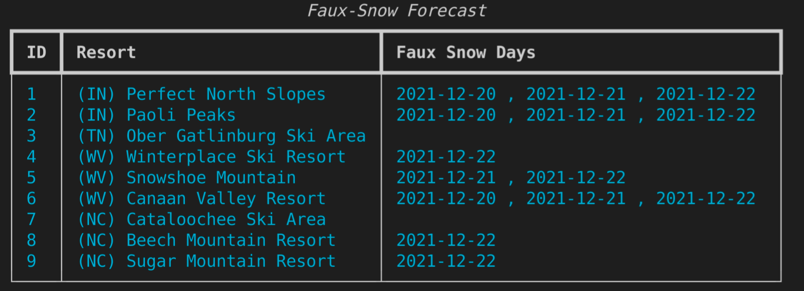
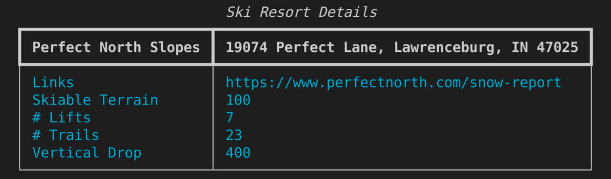

# faux-snow

After moving from Colorado to Kentucky I'm looking for some snowboarding options that don't involve a plane ride.This app will help find the best man-made powder conditions in the South and Midwest.
## What makes for good faux snow?

Good snow-making conditions require 2+ consecutive days of wet-bulb temperatures of 20(F) or below.

> If the temperature is around 30 F (-1 C), you need a fairly low relative humidity (less than 30 percent) for good snow-making conditions. If the temperature is less than 20 F (-6.7 C), you can make snow fairly easily even if the relative humidity is 100 percent. A temperature in the teens is ideal for snow-making.

- Source:  [howstuffworks.com](https://adventure.howstuffworks.com/outdoor-activities/snow-sports/snow-maker3.htm)

> Wet bulb temperature is the lowest temperature that can be obtained by evaporating water into the air at a constant pressure. The term comes from the technique of wrapping a wet cloth around a mercury bulb thermometer and blowing air over the cloth until the water evaporates. The wet bulb temperature is always lower than the dry bulb temperature, but will be identical with 100% relative humidity. This wet bulb temperature is what snowmakers use to know when they can make snow. You can see it is possible to make snow when the temperatures are above freezing but only with very low humidity. 

- Source: [snowathome.com](https://www.snowathome.com/pdf/wet_bulb_chart_fahrenheit.pdf)

Translating raw Temperature and Relative Humidity data into wet-bulb temperature is done with the following formula:

> `Tw = T * arctan(0.151977 * (rh + 8.313659)^(1/2)) `
> 
> `+ arctan(T + rh) `
> 
> `- arctan(rh - 1.676331) + 0.00391838 *(rh)^(3/2) `
> 
> `* arctan(0.023101 * rh) - 4.686035`

Where Tw = wet-bulb temperature; T = temperature (C); rh = Relative Humidity (%).

- Source: [omnicalculator.com](https://www.omnicalculator.com/physics/wet-bulb#how-to-calculate-the-wet-bulb-temperature)

### Wet-bulb Temperature Chart

|  | 10% | 20% | 30% | 40% | 50% | 60% | 70% |80% | 90% | 100% |
| ----------- | ----------- | ----------- | ----------- | ----------- | ----------- | ----------- | ----------- | ----------- | ----------- | ----------- |
| 20 | 14 | 14 | 15 | 16 | 16 | 17 | 18 | 19 | 19 | 20 |
| 22 | 15 | 15 | 17 | 17 | 18 | 19 | 20 | 21 | 21 | 22 |
| 24 | 17 | 18 | 18 | 19 | 20 | 21 | 22 | 22 | 23 | 24 |
| 26 | 18 | 19 | 20 | 21 | 22 | 23 | 23 | 24 | 25 | 25 |
| 28 | 20 | 21 | 22 | 23 | 23 | 24 | 25 | 26 | 27 | 28 |
| 30 | 21 | 22 | 23 | 24 | 25 | 26 | 27 | 28 | 29 | 30|

x (horizontal) axis = temperature (F)

y (vertical) axis = relative humidity

## How do I use it?

1. Get an account and API key from [AerisWeather](https://rapidapi.com/aerisweather-aerisweather/api/aerisweather1/).
2. Store the AERIS_API_HEADERS and  AERISWEATHER_API_URL in a file called config.py in the root folder of the app. 
3. Execute the fs-cli.py script using the following commands:

| Feature | Command |
| ----------- | ----------- |
| Refresh Forecast | fs-cli.py --refresh |
| Show Forecasts for Resorts | fs-cli.py --forecast |
| Show Resort Details | fs-cli.py resort_id --details |
| Show Help | fs-cli.py --help |

## Sample Forecast

## Sample Resort Details

## Feature Backlog
- [X] collect ski resort info in json file
- [X] write refresh() function to update the weather forecast for all resorts
- [X] write the forecasts() function to display the forecasts for all resorts
- [X] write the details(resort_id) function to display the details for a resort
- [X] implement the argument parser with argparse
- [X] implement console formatting with Rich
- [ ] add unit testing
- [ ] add error handling
- [ ] add/complete comments