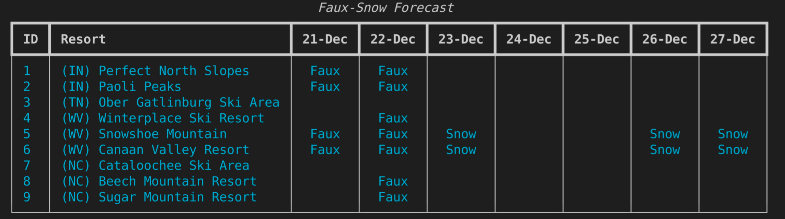
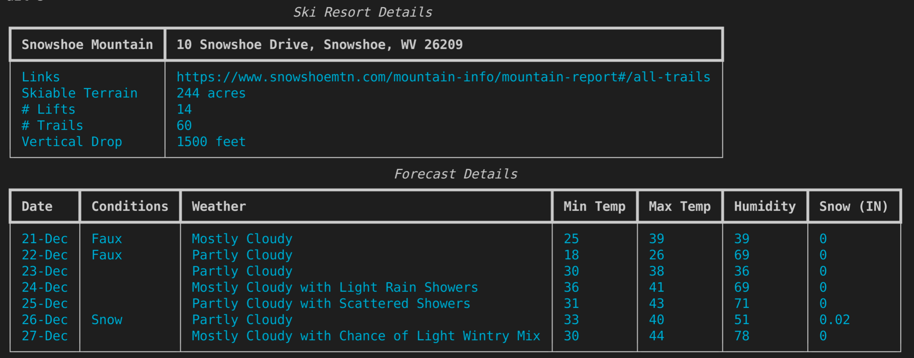
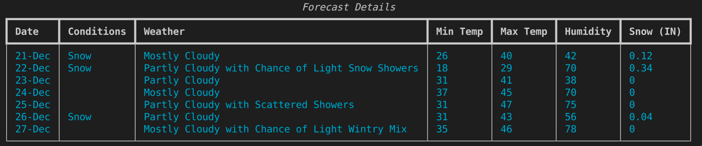

# faux/snow

After moving from Colorado to Kentucky I'm looking for some snowboarding options that don't involve a plane ride. In Colorado, ski plans are generally based on natural snowfall totals. The deeper the fresh powder, the better your day will be. There are great sites available that track snow totals and help you make plans - shoutout to [opensnow.com](https://opensnow.com).

In Kentkucy, the nearest ski resorts are in Indiana, West Virginia, Tennessee, and North Carolina. fresh snow is less frequent  with less total accumulation in these states. Snow forecasts are therefore less helpful in finding the best conditions. Rather than tracking snowfall, it makes more sense to track the optimal conditions for man-made snow. 

This app will help find the best man-made powder conditions in the South and Midwest.
## What makes for good faux snow?

Good snow-making conditions require 2+ consecutive days of wet-bulb temperatures of 20(F) or below.

> If the temperature is around 30 F (-1 C), you need a fairly low relative humidity (less than 30 percent) for good snow-making conditions. If the temperature is less than 20 F (-6.7 C), you can make snow fairly easily even if the relative humidity is 100 percent. A temperature in the teens is ideal for snow-making.

- Source:  [howstuffworks.com](https://adventure.howstuffworks.com/outdoor-activities/snow-sports/snow-maker3.htm)

> Wet bulb temperature is the lowest temperature that can be obtained by evaporating water into the air at a constant pressure. The term comes from the technique of wrapping a wet cloth around a mercury bulb thermometer and blowing air over the cloth until the water evaporates. The wet bulb temperature is always lower than the dry bulb temperature, but will be identical with 100% relative humidity. This wet bulb temperature is what snowmakers use to know when they can make snow. You can see it is possible to make snow when the temperatures are above freezing but only with very low humidity. 

- Source: [snowathome.com](https://www.snowathome.com/pdf/wet_bulb_chart_fahrenheit.pdf)

Translating raw Temperature and Relative Humidity data into wet-bulb temperature is done with the following formula:

> `Tw = T * arctan(0.151977 * (rh + 8.313659)^(1/2)) `
> 
> `+ arctan(T + rh) `
> 
> `- arctan(rh - 1.676331) + 0.00391838 *(rh)^(3/2) `
> 
> `* arctan(0.023101 * rh) - 4.686035`

Where 

Tw
: wet-bulb temperature 

T
: temperature (C)

rh
: Relative Humidity (%)

- Source: [omnicalculator.com](https://www.omnicalculator.com/physics/wet-bulb#how-to-calculate-the-wet-bulb-temperature)

### Wet-bulb Temperature Chart

Mapping the wet-bulb temperature against Temperature and Relative Humidity highlights the relationship between the two variables and ideal snow making conditions.

|  | 10% | 20% | 30% | 40% | 50% | 60% | 70% |80% | 90% | 100% |
| --- | --- | --- | --- | --- | --- | --- | --- | --- | --- | --- |
| **20 (F)** | **14** | **14** | **15** | **16** | **16** | **17** | **18** | **19** | **19** | **20** |
| **22 (F)** | **15** | **15** | **17** | **17** | **18** | **19** | **20** | 21 | 21 | 22 |
| **24 (F)** | **17** | **18** | **18** | **19** | **20** | 21 | 22 | 22 | 23 | 24 |
| **26 (F)** | **18** | **19** | **20** | 21 | 22 | 23 | 23 | 24 | 25 | 26 |
| **28 (F)** | **20** | 21 | 22 | 23 | 23 | 24 | 25 | 26 | 27 | 28 |
| **30 (F)** | 21 | 22 | 23 | 24 | 25 | 26 | 27 | 28 | 29 | 30|

vertical axis
: Temperature in Fahrenheit

horizontal axis
: Relative Humidity

## What is this? An app for nerds?

So what does all of this weather-math mean to me? This app will pull 7-day forecasts for ski resorts in the midwest and mid-atlantic and show you the best days for skiing based on the snow-making conditions. All the nerdy weather-math will be hidden behiind the scenes.
## How do I use it?

The current version of this app is a Command Line Interface (CLI) app. 

To use this you will need an environment on your computer that can run Python apps, an API key, and some basic text editing skillz. I know, not very useful right now. Eventually this will be a web app. That will make this actually useful. For now, follow these steps:

1. Get an account and API key from [AerisWeather](https://rapidapi.com/aerisweather-aerisweather/api/aerisweather1/).
1. Store the AERIS_API_HEADERS and  AERISWEATHER_API_URL in a file called config.py in the root folder of the app. 
1. Install the python modules as needed (numpy, rich, argparse) .
1. Execute the fs-cli.py script using the following commands:

| Feature | Command |
| ----------- | ----------- |
| Refresh Forecast | fs-cli.py --refresh |
| Show Forecasts for Resorts | fs-cli.py --forecast |
| Show Resort Details | fs-cli.py --details resort_id |
| Show Help | fs-cli.py --help |

## Sample Forecast

## Sample Resort Details

## Feature Backlog
- [X] collect ski resort info in json file
- [X] write refresh() function to update the weather forecast for all resorts
- [X] write the forecasts() function to display the forecasts for all resorts
- [X] write the details(resort_id) function to display the details for a resort
- [X] implement the argument parser with argparse
- [X] implement console formatting with Rich
- [ ] add unit testing
- [ ] add error handling
- [ ] add/complete comments